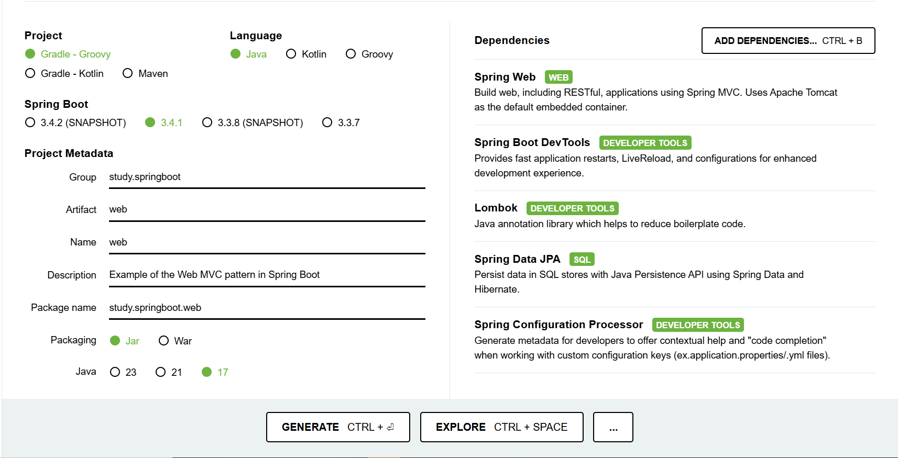
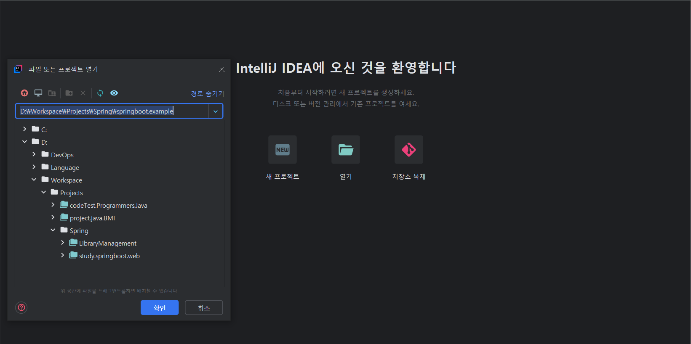

# study.springboot.web

Example of the Web MVC pattern in Spring Boot

## Initial setting
  1. Go to [spring initializr](https://start.spring.io/)
  2. Set up the following with spring initializr
      - Project
        - Select the type of project
      - Language
        - Select the language you want to use in your project 
      - Spring Boot
        - Select the version of Spring Boot  
      - Project Metadata
        - Select the Project Metadata 
          - Group
          - Artifact
          - Name
          - Description
          - Package
          - Packaging
          - Language Version
          - Dependencies
  3. Generate a project file.
     - 
  4. Unzip the generated project file and open it in the IDE
     - 
  

